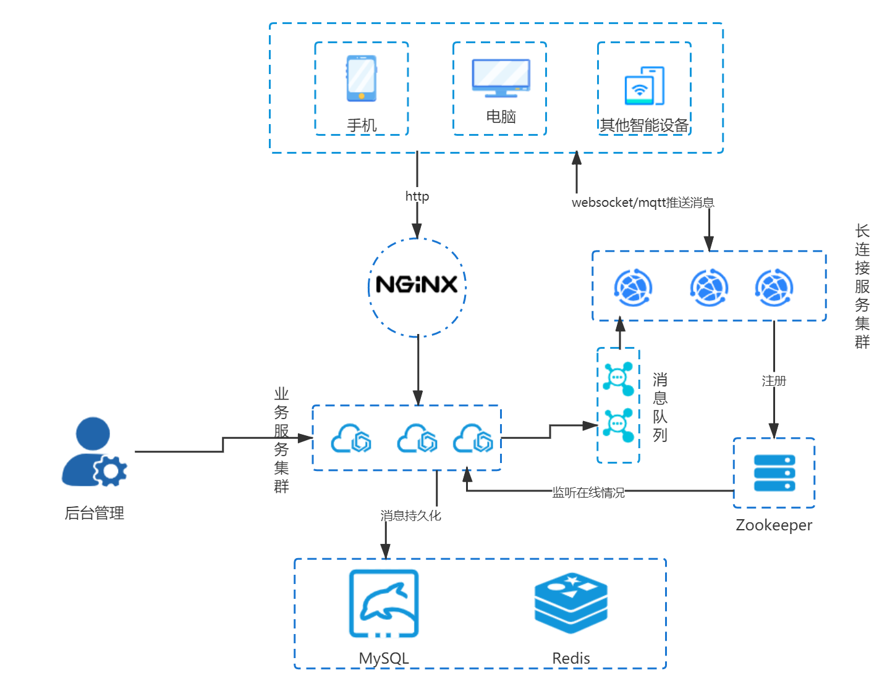

# MuChat

<p>
  <a href="#联系方式"></a>
  <a href="https://github.com/pisces-hub/muchat-ui"> </a>
  <a href="https://gitee.com/pisces-hub/muchat"></a>
</p>

## 友情提示

> 1. **快速体验项目**：[在线访问地址](http://43.138.164.74)


## 前言

`Muchat`100w级即时通讯应用

## 项目文档

待更新

## 项目介绍

`Muchat`是用JAVA语言开发的轻量、高性能、单机支持几十万至百万在线用户IM，主要目标降低即时通讯门槛，快速打造低成本接入在线IM系统，通过极简洁的消息格式就可以实现多端不同协议间的消息发送如内置(Http、Websocket、Tcp自定义IM协议)

### 项目演示

#### 前端演示项目

前端项目`muchat-ui`地址：https://github.com/pisces-hub/muchat-ui

项目演示地址： [http://43.138.164.74](http://43.138.164.74)


#### 后台系统

前端项目`muchat-admin-ui`地址：筹备开源中...


### 组织结构

``` lua
muchat
├── im-common -- 工具类及通用代码
├── im-connector -- 长连接服务
├── im-sdk -- 发送消息功能，封装公用模块
├── im-server -- 业务服务
└── im-admin -- 后台管理服务
```

### 技术选型

#### 后端技术

| 技术                 | 说明                | 官网                                           |
| -------------------- | ------------------- | ---------------------------------------------- |
| SpringBoot           | Web应用开发框架      | https://spring.io/projects/spring-boot         |
| MyBatis              | ORM框架             | http://www.mybatis.org/mybatis-3/zh/index.html |
| Redis                | 内存数据存储         | https://redis.io/                              |
| Nginx                | 静态资源服务器      | https://www.nginx.com/                         |
| Druid                | 数据库连接池        | https://github.com/alibaba/druid               |
| OSS                  | 对象存储            | https://github.com/aliyun/aliyun-oss-java-sdk  |
| MinIO                | 对象存储            | https://github.com/minio/minio                 |
| JWT                  | JWT登录支持         | https://github.com/jwtk/jjwt                   |
| Lombok               | Java语言增强库      | https://github.com/rzwitserloot/lombok         |
| Hutool               | Java工具类库        | https://github.com/looly/hutool                |
| PageHelper           | MyBatis物理分页插件 | http://git.oschina.net/free/Mybatis_PageHelper |
| Swagger-UI           | API文档生成工具      | https://github.com/swagger-api/swagger-ui      |
| Hibernator-Validator | 验证框架            | http://hibernate.org/validator                 |

#### 前端技术

| 技术       | 说明                  | 官网                                   |
| ---------- | --------------------- | -------------------------------------- |
| Vue        | 前端框架              | https://vuejs.org/                     |
| Vue-router | 路由框架              | https://router.vuejs.org/              |
| Vuex       | 全局状态管理框架      | https://vuex.vuejs.org/                |
| Element    | 前端UI框架            | https://element.eleme.io               |


#### 架构图

##### 系统架构图



### 开发环境

| 工具        | 版本号    | 下载                                             |
|-----------|--------|------------------------------------------------|
| JDK       | 11     |                                                |
| Mysql     | 8      | https://www.mysql.com/                         |
| Redis     | 7.0    | https://redis.io/download                      |
| Nginx     | 1.22   | http://nginx.org/en/download.html              |
| Zookeeper |  |  |


### 搭建步骤

> Windows环境部署

- 克隆`muchat`项目，并导入到IDEA中完成编译：


## 联系方式

QQ: 704566072


有任何问题，欢迎给我留言哦


## 点下star吧
喜欢的朋友麻烦点个star，鼓励一下作者吧！
## 许可证

[Apache License 2.0](https://github.com/pisces-hub/muchat/blob/develop/LICENSE)

Copyright (c) 2020-2023 muchat
